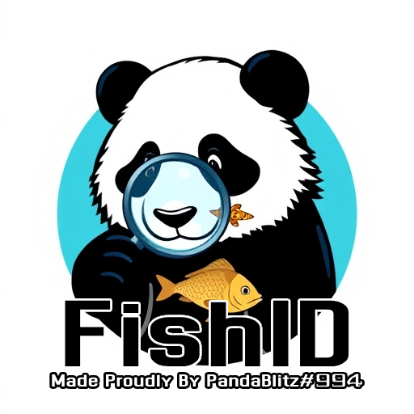

 

  
  

    A fish &amp; other marine species identification software, Used for real time detection in ROV's.
     
  

# About the project
A cutting-edge, highly reinforced, thoroughly rebuilt, completely remade, meticulously re-engineered, state-of-the-art, revamped, optimized, reimagined, and supercharged Fish Identification software—just better in every possible way. A fish & other marine species identification software, Used for real time detection in ROVs.

## Who are we?
We are PandaBlitz#994, An FLL team from Hakfar Hayarok in israel, and as absolute sigmas, we decided to make a marine species identification system. 

## How does it work?
Our fish identification system made in python uses two main componens, our DataBase, and our actual object detection algorithm.

## The algorithm
We use YoloV8, Very sigma object detection for real.

## Set-Up:

1. Run `python -m venv .venv` to create a virtual environment
2. Run `pip install -r requirements.txt` to install the libraries
3. Wait till it dowlonds all packages and dependencies - this may take a while

## Step-By-Step explanation on how we made the program.

### Finding a Dataset:
Finding a suitable dataset for our project was quite difficult. we searched on a couple different websites, like humanworks and kaggle, and at the end we settled on a small scale dataset from kaggle:
https://www.kaggle.com/datasets/markdaniellampa/fish-dataset
This dataset is perfect for us, as it has a nice amount of fish underwater, perfet to train our real-time detection model.

### Tagging tool:
We also searched across the entire world wide web for a good, free, simple Tagging software. We first started with cvat, but when we tried to export the Tags, we encountered a paywall. at the end, we setteled on an amazing tool that we would higly reccomend: https://github.com/developer0hye/Yolo_Label?tab=readme-ov-file 

### The model:
we are currently working on using yolov8 to make the program work. stay tuned, Version 1.0 comes soon.
